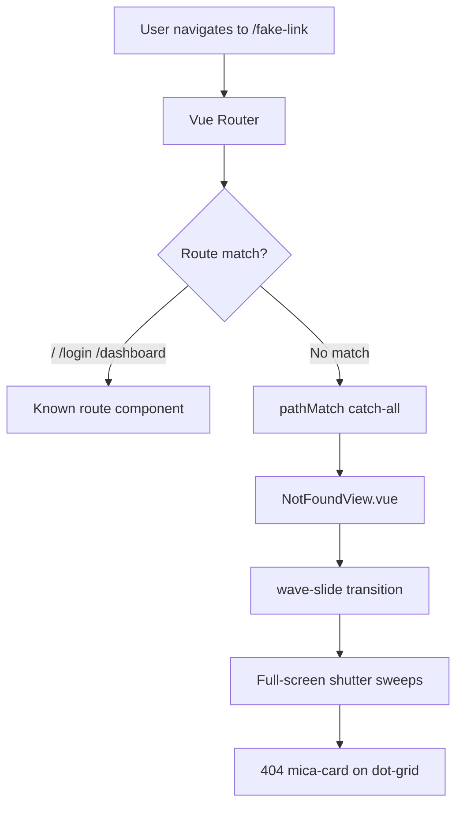

# 404 Not Found - Transmission Failure Module

## Current State

- **Router** ([src/router/index.ts](src/router/index.ts)): Three routes (`/`, `/login`, `/dashboard`). No catch-all; invalid paths like `/fake-link` would hit no route.
- **Layout**: All views render inside `App.vue`'s `<main>` with the `wave-slide` transition. The full-screen shutter (silver/gold/blue gradient) already animates on every route change.
- **Design system**: `.mica-card`, APC Blue `#34418F`, Gold `#DEAC4B`, `bg-dot-grid`, `font-mono`, corner crosshairs, Pasay coordinates, and corner screws are established in [HeroSection.vue](src/components/HeroSection.vue) and [LoginView.vue](src/views/LoginView.vue).

## Implementation

### 1. Add Catch-All Route

**File:** [src/router/index.ts](src/router/index.ts)

Append a catch-all route at the **end** of the routes array (order matters; it must match last):

```ts
{
  path: '/:pathMatch(.*)*',
  name: 'not-found',
  component: () => import('@/views/NotFoundView.vue'),
},
```

Vue Router 4's `pathMatch(.*)*` captures any unmatched path. Lazy-loading keeps the initial bundle small.

---

### 2. Create NotFoundView.vue

**File:** `src/views/NotFoundView.vue` (new file)

Structure mirrors [LoginView.vue](src/views/LoginView.vue):


| Element               | Implementation                                                                                                                                                                                  |
| --------------------- | ----------------------------------------------------------------------------------------------------------------------------------------------------------------------------------------------- |
| **Container**         | `<section class="relative flex min-h-0 flex-1 w-full flex-col items-center justify-center overflow-hidden px-4">` — matches LoginView so it fills the main area and centers content.            |
| **Corner crosshairs** | Four L-shaped divs: `left-4 top-4`, `right-4 top-4`, `bottom-4 left-4`, `bottom-4 right-4` with `border-l-2 border-t-2 border-gray-300` (and mirrored for each corner).                         |
| **Pasay coordinates** | `absolute left-2 top-1/2 -translate-y-1/2 -rotate-90 font-mono text-xs text-gray-400` — `COORD. 14.531105 N // 121.021309 E`                                                                    |
| **Error card**        | `.mica-card w-full max-w-lg p-12 rounded-3xl border border-gray-200 flex flex-col items-center text-center shadow-xl`                                                                           |
| **Corner screws**     | Four `h-2 w-2 rounded-full bg-gray-400 shadow-inner` at card corners                                                                                                                            |
| **Error code**        | `text-8xl md:text-9xl font-black font-mono text-[#34418F] tracking-tighter` — `404`                                                                                                             |
| **Subtitle**          | `text-lg md:text-xl font-bold font-mono text-[#DEAC4B] uppercase tracking-widest` — `Transmission Failed`                                                                                       |
| **Body**              | `text-gray-500 font-mono text-sm md:text-base` — "The requested destination could not be located in the registry..."                                                                            |
| **CTA**               | `<router-link to="/" class="bg-[#DEAC4B] text-white px-8 py-4 rounded-xl font-bold font-mono uppercase tracking-wider hover:scale-105 transition-all shadow-md">Return to System</router-link>` |


No script logic required; template-only component.

---

## Flow Diagram




---

## Testing

1. Run dev server: `npm run dev`
2. Navigate to `http://localhost:5173/this-is-a-fake-link`
3. Expect: wave-slide shutter animation, then 404 panel with "Transmission Failed" on the dot-grid background.

---

## Notes

- **UX rule** ([.cursor/rules/ux-copy-ctas.mdc](.cursor/rules/ux-copy-ctas.mdc)): "Return to System" is acceptable; no bracketed text.
- **Container height**: Using `min-h-0 flex-1` (same as LoginView) instead of `min-h-[calc(100vh-120px)]` so the view fits the existing flex layout and behaves like other views.
- **Transition**: No changes to `App.vue`; the 404 route uses the same `wave-slide` transition as all routes.

