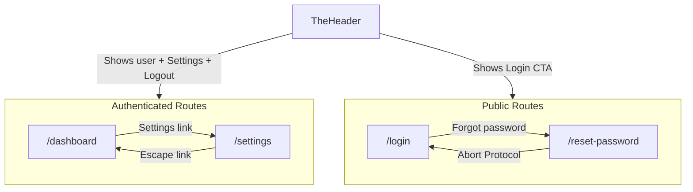

# Account Settings & Password Reset UIs

## Summary

Add two security interfaces: **SettingsView** (password change for logged-in admin) and **ResetPasswordView** (account recovery for logged-out users). Both follow the existing "Nothing OS" industrial aesthetic used in [ContactView.vue](src/views/ContactView.vue) and [DashboardView.vue](src/views/DashboardView.vue).

---

## 1. Create SettingsView (`src/views/SettingsView.vue`)

New file with:

- **Layout**: Centered card on `bg-[#E5E5E5]`, white card with `border-gray-300`, blue accent bar (`h-2 bg-[#34418F]`) at top
- **Header**: "SYSTEM SETTINGS" / "Administrator Console" with `[ ESCAPE ]` link back to `/dashboard`
- **Form**: Three password fields (Current, New, Confirm) with validation:
  - New and Confirm must match
  - New password must be at least 8 characters
- **Submit**: "UPDATE CREDENTIALS" button (gold `#DEAC4B`), disabled state shows "ENCRYPTING..."
- **Logic**: `handleUpdatePassword` uses `useToast` for success/error; mock `setTimeout` for save (no real API yet)
- **Imports**: `ref`, `reactive` from Vue; `useToast` from `@/composables/useToast`; `useRouter` for the escape link

**Note**: The spec uses `[ ESCAPE ]` for the back link. The project rule [ux-copy-ctas.mdc](.cursor/rules/ux-copy-ctas.mdc) discourages bracketed CTAs. Consider "Back to Dashboard" or "Escape" without brackets if you want to align with the rule.

---

## 2. Create ResetPasswordView (`src/views/ResetPasswordView.vue`)

New file with:

- **Layout**: Centered card on `bg-[#E5E5E5]`, red accent bar (`h-2 bg-red-600`) at top
- **Header**: Warning icon, "EMERGENCY OVERRIDE" / "Protocol: Password Recovery"
- **Form**: Single email field (placeholder `admin@eypi.cc`)
- **Submit**: "INITIATE RECOVERY" button (red `bg-red-600`), disabled state shows "TRANSMITTING..."
- **Footer**: "← Abort Protocol" link back to `/login`
- **Logic**: `handleRecovery` shows success toast, then `router.push('/login')` after mock delay
- **Imports**: `ref` from Vue; `useToast`, `useRouter`

---

## 3. Register Routes (`src/router/index.ts`)

Add two routes **before** the `/:slug` catch-all (around line 38):

```typescript
{
  path: '/settings',
  name: 'settings',
  component: () => import('@/views/SettingsView.vue'),
},
{
  path: '/reset-password',
  name: 'reset-password',
  component: () => import('@/views/ResetPasswordView.vue'),
},
```

Order matters: `/settings` and `/reset-password` must be defined before `/:slug` so they are not matched as slugs.

---

## 4. Wire Navigation

### 4a. TheHeader – Settings link

The `angelo@eypi.cc` text lives in [TheHeader.vue](src/components/TheHeader.vue) (not DashboardView), inside the block shown when `route.path === '/dashboard'`.

- Add a Settings `router-link` to `/settings` next to the user email
- Extend the condition so the logged-in block also shows when `route.path === '/settings'` (otherwise the header would show "Login" on the settings page)

```html
<template v-if="route.path === '/dashboard' || route.path === '/settings'">
  <span class="font-mono text-sm font-bold text-[#34418F]">angelo@eypi.cc</span>
  <router-link to="/settings" class="ml-4 font-mono text-xs font-bold text-[#34418F] hover:text-[#DEAC4B] uppercase tracking-wider transition-colors">
    Settings
  </router-link>
  <a href="#" ...>Logout</a>
</template>
```

### 4b. LoginView – Reset password link

Add a "Forgot password?" or "Reset password" link in [LoginView.vue](src/views/LoginView.vue) that routes to `/reset-password`. Place it below the password field or submit button, styled to match the industrial aesthetic (e.g. `font-mono text-xs text-gray-500 hover:text-[#34418F]`).

---

## File Changes Overview


| File                              | Action                                    |
| --------------------------------- | ----------------------------------------- |
| `src/views/SettingsView.vue`      | Create                                    |
| `src/views/ResetPasswordView.vue` | Create                                    |
| `src/router/index.ts`             | Add 2 routes before `/:slug`              |
| `src/components/TheHeader.vue`    | Add Settings link, extend route condition |
| `src/views/LoginView.vue`         | Add link to `/reset-password`             |


---

## Architecture




---

## Out of Scope (for later)

- Auth guards (Settings/ResetPassword are currently unprotected)
- Real password change API
- Real password reset email flow

