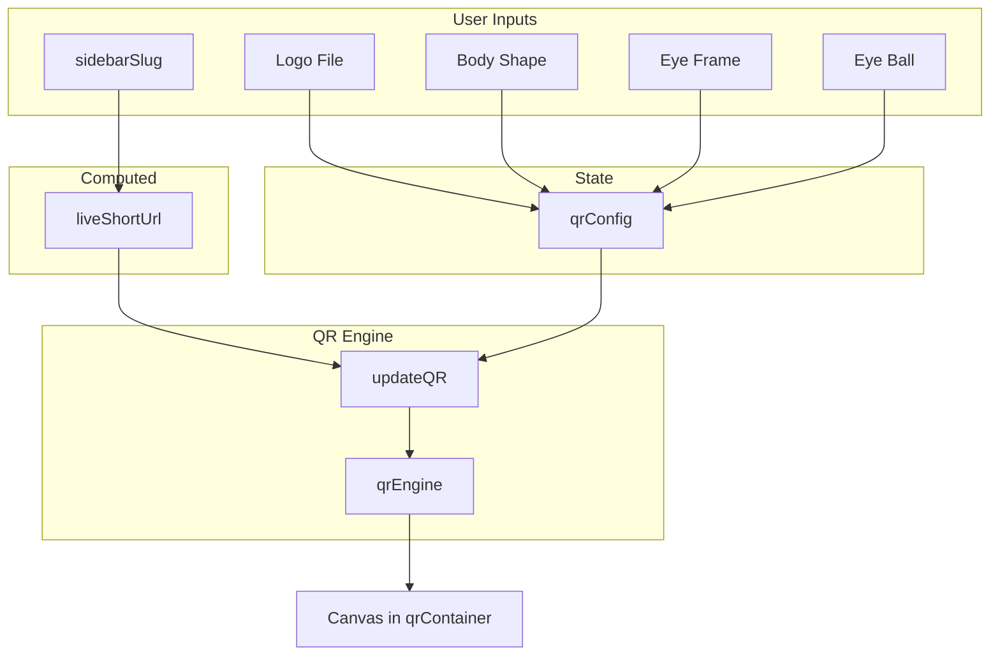

# Advanced Client-Side QR Code Generator

## Context

- **Target file:** [src/views/DashboardView.vue](src/views/DashboardView.vue)
- **Library:** `qr-code-styling` (already in [package.json](package.json) v1.9.2)
- **Toast:** `useToast` composable already used; `toast.success()` available
- **Placement:** New "Optical Routing Matrix" section inside the sidebar, between the Custom Slug Input and the Save button

## Implementation

### 1. Script Setup – Imports and State

**Add imports:**

- `QRCodeStyling` from `'qr-code-styling'`
- `computed`, `watch`, `nextTick` from `'vue'` (in addition to existing `ref`)

**Add refs and state:**

- `qrContainer = ref<HTMLElement | null>(null)` – DOM ref for the QR canvas
- `qrConfig` – reactive config object with `dotType`, `eyeFrameType`, `eyeBallType`, `logoUrl` (typed as specified)

**Add computed:**

- `liveShortUrl = computed(() => 'https://eypi.cc/' + (sidebarSlug.value.trim() || 'preview'))`

### 2. Script Setup – QR Engine and Update Logic

**Initialize engine** (top-level in script setup):

```typescript
const qrEngine = new QRCodeStyling({
  width: 240,
  height: 240,
  type: 'canvas',
  imageOptions: { crossOrigin: 'anonymous', margin: 8 }
})
```

**Add `updateQR()`** – applies `liveShortUrl`, `qrConfig` (logo, dots, corners) to `qrEngine.update()` with color `#34418F`.

**Watchers:**

- Watch `liveShortUrl` → call `updateQR()`
- Watch `qrConfig` with `{ deep: true }` → call `updateQR()`
- Watch `isSidebarOpen` → when `true`, `await nextTick()`, then `qrEngine.append(qrContainer.value)` and `updateQR()`

### 3. Script Setup – Handlers

`**handleLogoUpload(event)`** – read first file from `(event.target as HTMLInputElement).files?.[0]`, set `qrConfig.value.logoUrl = URL.createObjectURL(file)`.

**Note:** The spec had `files?.` – it must be `files?.[0]` to get the first file.

`**downloadQR()`** – call `qrEngine.download({ name: 'eypi-qr-' + (sidebarSlug.value || 'link'), extension: 'png' })` and `toast.success('QR Code exported successfully')`.

### 4. Template – Optical Routing Matrix Section

Insert the new block **inside** the sidebar’s `flex flex-1 flex-col` div, **after** the Custom Slug Input (line ~174) and **before** the Save button (line ~176).

**Structure:**

- Wrapper: `mt-8 mb-auto flex flex-col border-t border-gray-200 pt-8`
- Heading: "Optical Routing Matrix"
- Preview: centered div with `ref="qrContainer"` inside a bordered, rounded container
- Controls:
  - Body Shape select (`qrConfig.dotType`): square, dots, rounded, classy
  - Grid: Eye Frame select (`qrConfig.eyeFrameType`): square, dot, extra-rounded
  - Eye Ball select (`qrConfig.eyeBallType`): square, dot
  - Center Logo file input with `@change="handleLogoUpload"` and `accept="image/*"`
- Export button: `@click="downloadQR"` – "Export PNG"

Use the provided classes for the Nothing OS industrial look (font-mono, gray palette, `#34418F` accents).

### 5. Data Flow




### 6. Edge Cases

- **Sidebar open:** On `isSidebarOpen` true, `nextTick` ensures `qrContainer` is mounted before `append()`.
- **Sidebar closed:** Sidebar is removed via `v-if`; on reopen, a fresh container is mounted and `append()` runs again.
- **Empty slug:** `liveShortUrl` falls back to `'preview'` so the QR always shows something.
- **Logo cleanup:** Consider revoking object URLs when changing/removing logos to avoid leaks; optional enhancement.

## Files Changed


| File                                                       | Changes                                                      |
| ---------------------------------------------------------- | ------------------------------------------------------------ |
| [src/views/DashboardView.vue](src/views/DashboardView.vue) | Imports, state, engine, watchers, handlers, template section |


## Verification

- Run `npm run dev` and open the dashboard.
- Click edit on a link to open the sidebar.
- Confirm QR preview updates when changing slug and shape options.
- Upload a logo and verify it appears in the center.
- Click "Export PNG" and confirm download and toast.

