# Async Analytics Tracking and Aggregation Endpoint

## Current State

- **Redirect route**: `[backend/src/index.ts](backend/src/index.ts)` lines 97-116 — `GET /api/links/:slug` returns `{ original_url }` and awaits a clicks UPDATE. Frontend (`[src/views/RedirectView.vue](src/views/RedirectView.vue)`) fetches this and redirects via `window.location.replace`.
- **Auth pattern**: JWT in `Authorization: Bearer <token>`, verified via `verify(token, c.env.JWT_SECRET, 'HS256')` with `payload.sub` as user ID.
- **Deployment**: Cloudflare Workers via wrangler; Hono app exported as default.
- **Database**: Turso (libSQL). `links` table exists with `id`, `user_id`, `original_url`, `slug`, `clicks`. No `analytics` table yet.

---

## Prerequisite: Create `analytics` Table

Run this SQL against Turso (e.g. `turso db shell` or Turso dashboard):

```sql
CREATE TABLE IF NOT EXISTS analytics (
  id INTEGER PRIMARY KEY AUTOINCREMENT,
  link_id TEXT NOT NULL,
  os TEXT NOT NULL,
  country TEXT NOT NULL,
  referrer TEXT NOT NULL,
  created_at TEXT DEFAULT (datetime('now')),
  FOREIGN KEY (link_id) REFERENCES links(id)
);
CREATE INDEX IF NOT EXISTS idx_analytics_link_id ON analytics(link_id);
CREATE INDEX IF NOT EXISTS idx_analytics_created_at ON analytics(created_at);
```

---

## 1. OS Detection Helper

Add a lightweight helper near the top of `[backend/src/index.ts](backend/src/index.ts)` (after `normalizeUrl`):

```ts
function getOS(userAgent: string | null): string {
  if (!userAgent) return 'Unknown'
  const ua = userAgent.toLowerCase()
  if (ua.includes('win')) return 'Windows'
  if (ua.includes('mac')) return 'macOS'
  if (ua.includes('iphone') || ua.includes('ipad')) return 'iOS'
  if (ua.includes('android')) return 'Android'
  if (ua.includes('linux')) return 'Linux'
  return 'Unknown'
}
```

Order matters: check `mac` after `win` to avoid matching "Windows" UA substrings; check `iphone`/`ipad` before `mac` to avoid iPad UA matching "Mac".

---

## 2. Update Redirect Route (`GET /api/links/:slug`)

**Target**: `[backend/src/index.ts](backend/src/index.ts)` lines 97-116.

### 2.1 Extract request metadata

- `userAgent`: `c.req.header('User-Agent') ?? null`
- `referrer`: `c.req.header('Referer') ?? 'Direct'`
- `country`: `(c.req.raw as Request & { cf?: { country?: string } }).cf?.country ?? 'Unknown'`

### 2.2 Include `id` in the SELECT

Change the query to:

```ts
sql: 'SELECT id, original_url FROM links WHERE slug = ?'
```

Use `id` for the analytics `link_id`.

### 2.3 Fire-and-forget analytics INSERT via `waitUntil`

- Do **not** await the analytics insert.
- Use `c.executionCtx.waitUntil(...)` to run the INSERT after the response is sent.
- Wrap in try-catch: `executionCtx` can throw on non-CF runtimes (e.g. local dev); if unavailable, skip the analytics insert or log.

```ts
try {
  const ctx = c.executionCtx
  if (ctx) {
    const linkId = (row as { id: string }).id
    const os = getOS(userAgent)
    ctx.waitUntil(
      db.execute({
        sql: 'INSERT INTO analytics (link_id, os, country, referrer) VALUES (?, ?, ?, ?)',
        args: [linkId, os, country, referrer],
      })
    )
  }
} catch {
  // executionCtx not available (e.g. non-CF runtime)
}
```

### 2.4 Response flow

1. SELECT link (id, original_url).
2. If not found → 404.
3. Extract userAgent, referrer, country.
4. Compute `os = getOS(userAgent)`.
5. Schedule analytics INSERT via `waitUntil` (no await).
6. Return `c.json({ original_url: row.original_url })` immediately.

**Note**: The existing `UPDATE links SET clicks = ...` is still awaited. The task only requires the analytics INSERT to be async. Optionally, you could move the clicks UPDATE into `waitUntil` as well to further reduce redirect latency.

---

## 3. Analytics Aggregation Route (`GET /api/links/:id/analytics`)

**Target**: `[backend/src/index.ts](backend/src/index.ts)`. Define this route **before** `GET /api/links/:slug` so `/api/links/:id/analytics` is matched correctly.

### 3.1 Auth and ownership

- Require `Authorization: Bearer <token>`.
- Verify JWT and get `payload.sub`.
- Check ownership: `SELECT id FROM links WHERE id = ? AND user_id = ?`.
- If no row → 404 (or 403) with `{ error: 'Link not found or access denied' }`.

### 3.2 Aggregation queries

Run these 4 queries (all with `args: [id]`):


| Dataset  | SQL                                                                                                                                                                         |
| -------- | --------------------------------------------------------------------------------------------------------------------------------------------------------------------------- |
| OS       | `SELECT os, COUNT(*) as count FROM analytics WHERE link_id = ? GROUP BY os`                                                                                                 |
| Country  | `SELECT country, COUNT(*) as count FROM analytics WHERE link_id = ? GROUP BY country`                                                                                       |
| Referrer | `SELECT referrer, COUNT(*) as count FROM analytics WHERE link_id = ? GROUP BY referrer`                                                                                     |
| Timeline | `SELECT DATE(created_at) as date, COUNT(*) as count FROM analytics WHERE link_id = ? AND created_at >= date('now', '-30 days') GROUP BY DATE(created_at) ORDER BY date ASC` |


The timeline query uses `date('now', '-30 days')` to restrict to the last 30 days; `LIMIT 30` is unnecessary with this filter.

### 3.3 Response shape

```ts
{
  os: Array<{ os: string; count: number }>,
  country: Array<{ country: string; count: number }>,
  referrer: Array<{ referrer: string; count: number }>,
  timeline: Array<{ date: string; count: number }>
}
```

Map each result set to the expected shape (e.g. `os` rows to `{ os: row.os, count: row.count }`).

---

## 4. Hono Types for Cloudflare

Ensure the Hono app can access `executionCtx` and `cf`. If needed, extend the app type:

```ts
type Bindings = {
  TURSO_DATABASE_URL: string
  TURSO_AUTH_TOKEN: string
  JWT_SECRET: string
  RESEND_API_KEY: string
}

// For Cloudflare Workers
type Variables = {}
type AppType = { Bindings: Bindings; Variables: Variables }
const app = new Hono<AppType>()
```

`executionCtx` is provided by Hono’s Cloudflare Workers adapter when running on Workers. Use `c.executionCtx` in the handler.

---

## 5. Route Order

Place the analytics route before the generic slug route:

```ts
// 1. GET /api/links/:id/analytics (auth required)
app.get('/api/links/:id/analytics', async (c) => { ... })

// 2. GET /api/links/:slug (public redirect lookup)
app.get('/api/links/:slug', async (c) => { ... })
```

---

## Data Flow

```mermaid
flowchart TB
    subgraph RedirectFlow
        User[User visits eypi.cc/slug]
        Fetch[GET /api/links/slug]
        Select[SELECT id original_url]
        Extract[Extract UA Referer cf.country]
        WaitUntil[waitUntil INSERT analytics]
        Response[Return original_url JSON]
        User --> Fetch
        Fetch --> Select
        Select --> Extract
        Extract --> WaitUntil
        Extract --> Response
        Response --> Frontend[RedirectView redirects]
    end

    subgraph AnalyticsFlow
        Dashboard[Dashboard fetches analytics]
        Auth[Verify JWT]
        Own[Check link ownership]
        Agg[4 aggregation queries]
        JSON[Return os country referrer timeline]
        Dashboard --> Auth
        Auth --> Own
        Own --> Agg
        Agg --> JSON
    end
```




---

## Files to Modify


| File                                           | Changes                                                                                             |
| ---------------------------------------------- | --------------------------------------------------------------------------------------------------- |
| `[backend/src/index.ts](backend/src/index.ts)` | Add `getOS`, update `GET /api/links/:slug` with async analytics, add `GET /api/links/:id/analytics` |
| New migration (optional)                       | `backend/migrations/create_analytics.sql` with the `CREATE TABLE` above                             |


---

## Manual Step

Run the `CREATE TABLE analytics` SQL against your Turso database before deploying.