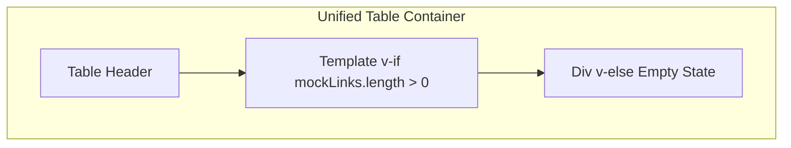

# Dashboard Empty State Enhancement

## Current Structure

In [src/views/DashboardView.vue](src/views/DashboardView.vue), the table body is a single `v-for` loop (lines 35-95):

```35:39:src/views/DashboardView.vue
      <!-- Table Rows -->
      <div
        v-for="link in mockLinks"
        :key="link.id"
        class="flex items-center justify-between border-b border-gray-100 px-6 py-5 transition-colors last:border-0 hover:bg-white/50"
```

`mockLinks` is initialized with 2 items (lines 234-237). The empty state will appear when the user deletes all links or when `mockLinks` is empty.

---

## Implementation

### 1. Wrap the row loop with conditional rendering

Use a `<template>` wrapper so the `v-for` only renders when there are links:

```html
<!-- Table Rows -->
<template v-if="mockLinks.length > 0">
  <div
    v-for="link in mockLinks"
    :key="link.id"
    class="flex items-center justify-between border-b border-gray-100 px-6 py-5 transition-colors last:border-0 hover:bg-white/50"
  >
    <!-- ... existing row content ... -->
  </div>
</template>
```

### 2. Add the empty state block

Immediately after the closing `</template>`, add the `v-else` block that spans the full table width:

```html
<div
  v-else
  class="flex flex-col items-center justify-center py-20 px-6 text-center"
>
  <div class="w-16 h-16 mb-6 rounded-full border border-dashed border-gray-300 flex items-center justify-center text-gray-400 relative">
    <div class="absolute w-2 h-[1px] bg-gray-400"></div>
    <div class="absolute h-2 w-[1px] bg-gray-400"></div>
  </div>
  <h3 class="font-mono text-sm font-bold text-gray-500 uppercase tracking-widest mb-2">
    NO ACTIVE TRANSMISSIONS
  </h3>
  <p class="font-mono text-sm text-gray-400 max-w-md leading-relaxed">
    The registry is currently empty. Enter a destination URL in the console above to establish a new routing sequence.
  </p>
</div>
```

The empty state includes:

- **Icon**: Dashed circle with a crosshair (horizontal + vertical lines)
- **Heading**: "NO ACTIVE TRANSMISSIONS" (monospace, uppercase, tracking)
- **Body**: Technical copy directing the user to the input above

---

## Placement Diagram




---

## Testing

To verify the empty state:

1. Run the app and open the Dashboard.
2. Delete both existing links via the delete button and confirm each deletion.
3. The empty state should appear in place of the table rows.

Alternatively, temporarily set `mockLinks` to `ref<Link[]>([])` in the script to start with an empty list.