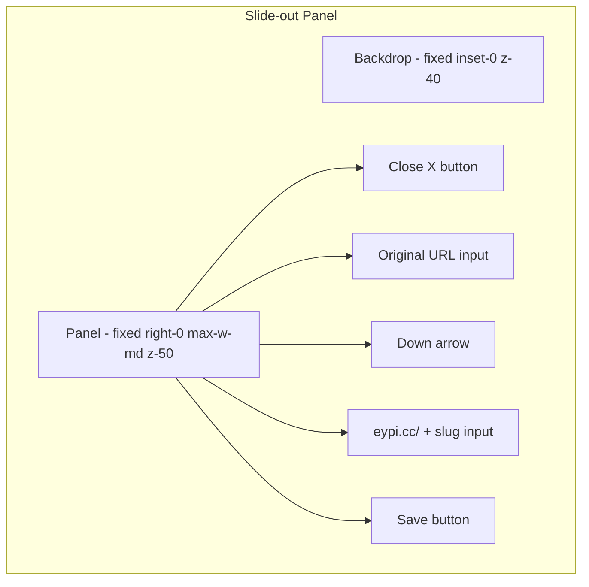

# Dashboard & Slide-out Panel Implementation Plan

## Current State

- **Router** ([src/router/index.ts](src/router/index.ts)): Has `/` and `/login` routes; needs `/dashboard`.
- **Design system**: `.mica-card` in [src/styles/main.css](src/styles/main.css), APC Blue `#34418F`, Gold `#DEAC4B`, `bg-dot-grid`, `font-mono`.
- **Reference patterns**: Gold button and mechanical inputs from [LoginView.vue](src/views/LoginView.vue); `eypi.cc/` prefix + slug from [HeroSection.vue](src/components/HeroSection.vue) (lines 58–60).

---

## 1. Update Vue Router

**File:** [src/router/index.ts](src/router/index.ts)

Add the dashboard route after the login route:

```ts
{
  path: '/dashboard',
  name: 'dashboard',
  component: () => import('@/views/DashboardView.vue'),
},
```

---

## 2. Create DashboardView.vue

**File:** `src/views/DashboardView.vue` (new)

### State & Logic (script setup)

```ts
const longUrlInput = ref('')
const isSidebarOpen = ref(false)
const mockLinks = ref([
  { id: 1, original: 'https://github.com/gelolaus', short: 'eypi.cc/gelo' },
  { id: 2, original: 'https://google.com', short: 'eypi.cc/search' },
])

function openSidebar() {
  isSidebarOpen.value = true
}
```

**Optional enhancement:** Add `editingLink` ref to pre-populate the sidebar when Edit is clicked (e.g. `editingLink = ref<typeof mockLinks[0] | null>(null)`). The current spec does not require this; the sidebar can open empty for now.

---

## 3. Main Layout Structure

```html
<div class="flex flex-col items-center w-full min-h-[calc(100vh-120px)] pt-12 px-4 relative max-w-5xl mx-auto">
  <!-- Top Bar -->
  <div class="flex w-full gap-4 mb-10">
    <input v-model="longUrlInput" ... />
    <button @click="openSidebar()">Shorten</button>
  </div>
  <!-- Links List -->
  <div class="w-full flex flex-col gap-4">
    <!-- v-for cards -->
  </div>
</div>
```

**Input:** `flex-1 bg-white/40 backdrop-blur-md border-2 border-gray-200 focus:border-[#34418F] rounded-xl px-6 py-4 font-mono outline-none shadow-inner`

**Button:** `bg-[#DEAC4B] text-white px-8 py-4 rounded-xl font-bold uppercase tracking-wider hover:scale-105 transition-all` (matches existing Gold CTA pattern)

---

## 4. Links List Cards

- **Container:** `w-full flex flex-col gap-4`
- **Card:** `.mica-card w-full flex justify-between items-center p-5 rounded-2xl border border-gray-200`
- **Left:** Flex column — `link.short` (APC Blue, bold, mono, lg) + `link.original` (gray-500, mono, sm, truncate, max-w-md)
- **Right:** Flex row gap-4 — Edit button (blue-500) + Delete button (red-500), both with pencil/trash SVGs

**Edit button:** `@click="openSidebar"` (or `@click="openSidebar(link)"` if editing is wired later)

**SVGs:** Use inline SVG for pencil (e.g. `path` for edit icon) and trash (delete icon). Heroicons-style paths are sufficient.

---

## 5. Slide-out Sidebar (Editor)

**Structure:**




- **Backdrop:** `fixed inset-0 bg-black/20 backdrop-blur-sm z-40` with `@click="isSidebarOpen = false"`
- **Panel:** `fixed top-0 right-0 h-full w-full max-w-md mica-card border-l border-gray-300 z-50 p-8 flex flex-col shadow-2xl`
- **Close button:** Top-right, sets `isSidebarOpen = false`
- **Original URL input:** Mechanical style, bound to `longUrlInput` (or `editingLink?.original` when editing)
- **Arrow:** `text-[#34418F] text-4xl font-black my-4 text-center` — `↓`
- **Custom slug input:** Flex row — `eypi.cc/` in APC Blue + borderless input for slug (same pattern as HeroSection preview but editable)
- **Save button:** Gold, full-width, "Save"

**Conditional:** `v-if="isSidebarOpen"` on the sidebar wrapper; wrap in `<transition name="slide-right">` for both backdrop and panel.

---

## 6. Sidebar Transition CSS

Add to `<style scoped>`:

```css
.slide-right-enter-active,
.slide-right-leave-active {
  transition: transform 0.4s cubic-bezier(0.2, 1, 0.3, 1);
}
.slide-right-enter-from,
.slide-right-leave-to {
  transform: translateX(100%);
}
```

---

## 7. UX Copy Rule

Per [.cursor/rules/ux-copy-ctas.mdc](.cursor/rules/ux-copy-ctas.mdc): Use "Shorten" and "Save" (no bracketed text). The spec’s uppercase for buttons matches the existing design system (Login, Register).

---

## 8. Files Changed Summary


| File                                       | Action                 |
| ------------------------------------------ | ---------------------- |
| [src/router/index.ts](src/router/index.ts) | Add `/dashboard` route |
| `src/views/DashboardView.vue`              | Create new file        |


---

## 9. Optional Follow-ups (Out of Scope)

- Wire Edit to pre-populate sidebar with `link.original` and `link.short` slug
- Implement Delete handler
- Implement Save handler (persist or update `mockLinks`)
- Add route guard so `/dashboard` requires auth (if auth module exists)

