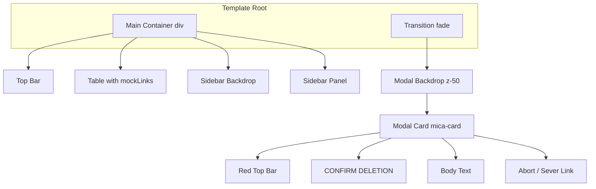

# Destructive Action Modal Implementation

## Target File

`[src/views/DashboardView.vue](src/views/DashboardView.vue)`

## Current State

- **Delete button** (lines 74-93): Red trash icon with `aria-label="Delete"` but no click handler
- **mockLinks**: Reactive ref at line 180; filtered via `mockLinks.value.findIndex` in `onSave`
- **Fade transition**: Already defined in scoped styles (lines 255-261)
- **Root template**: Single `<div>` wrapping all content including sidebar transitions

## Implementation Plan

### 1. Script Setup (after line 183, before `mockLinks`)

Add two refs:

```ts
const isDeleteModalOpen = ref(false)
const linkToDelete = ref<Link | null>(null)
```

Use `Link | null` instead of `any` for type safety (matches existing `Link` interface).

Add three functions (after `onSave`, before `</script>`):

```ts
function confirmDelete(link: Link): void {
  linkToDelete.value = link
  isDeleteModalOpen.value = true
}

function cancelDelete(): void {
  isDeleteModalOpen.value = false
  linkToDelete.value = null
}

function executeDelete(): void {
  if (!linkToDelete.value) return
  mockLinks.value = mockLinks.value.filter((l) => l.id !== linkToDelete.value!.id)
  cancelDelete()
}
```

### 2. Update Delete Button (line 74-77)

Add click handler to the Delete button:

```html
@click="confirmDelete(link)"
```

### 3. Modal UI (new root element)

Vue 3 supports multiple root elements. Add a second root element after the main `<div>` (before `</template>`):

- Wrap in `<Transition name="fade">` with `v-if="isDeleteModalOpen"`
- **Backdrop**: `fixed inset-0 z-50 flex items-center justify-center bg-black/40 backdrop-blur-sm p-4` with `@click.self="cancelDelete"`
  - Note: Spec had `z-` (incomplete); use `z-50` so modal appears above sidebar (z-40)
- **Modal card**: `.mica-card` with `w-full max-w-md p-8 rounded-2xl border border-red-500/30 flex flex-col shadow-2xl relative overflow-hidden`
- **Top accent**: `absolute top-0 left-0 w-full h-1 bg-red-500`
- **Header**: `[ CONFIRM DELETION ]` (font-mono, text-xl, font-black, text-red-500, tracking-widest, uppercase)
- **Body**: Message with `{{ linkToDelete?.short }}` in bold `#34418F`
- **Actions**: Flex row with "Abort" (cancel) and "Sever Link" (execute delete) buttons

### 4. CSS

Fade transition classes already exist (lines 255-261). No changes needed.

## UX Rule Note

`[.cursor/rules/ux-copy-ctas.mdc](.cursor/rules/ux-copy-ctas.mdc)` advises against bracketed text for CTAs. The header `[ CONFIRM DELETION ]` is a label, not a button. The action buttons use "Abort" and "Sever Link" (no brackets), so the rule is satisfied.

## Structure After Changes




