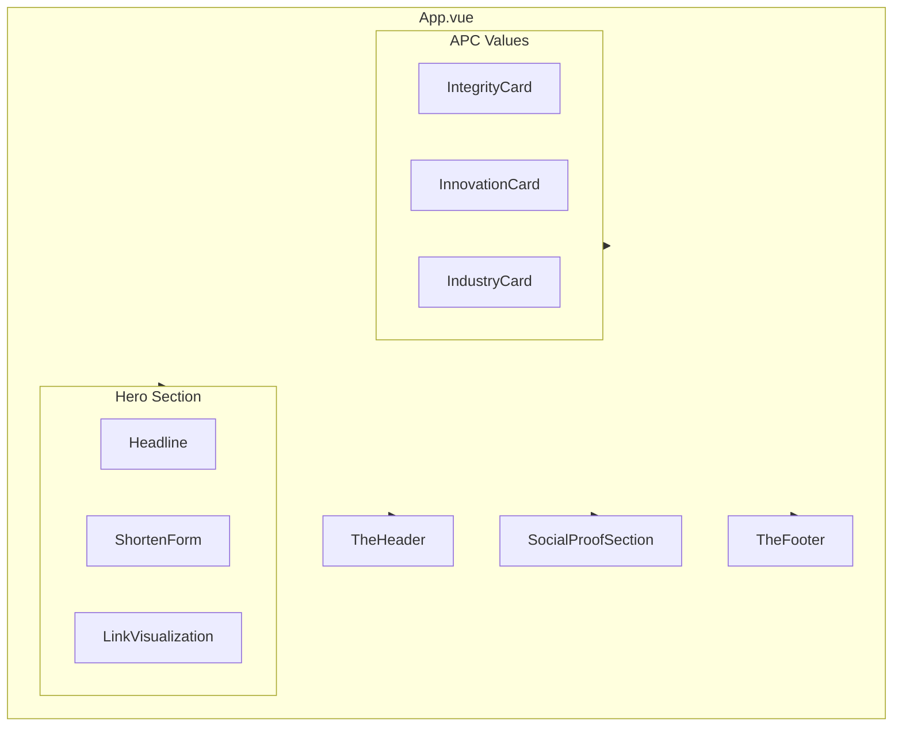

# eypi.cc Landing Page Design Plan

## Current State

The workspace is an **empty Git repository** with no Vue/Vite setup. The plan includes full project scaffolding plus all landing page components.

---

## Architecture Overview




---

## 1. Project Scaffolding

**Initialize Vue + Vite project:**

- Run `npm create vue@latest` with options: TypeScript (optional, can use JS), Vue Router (No for landing-only), Pinia (No), Vitest (No), ESLint (Yes), Prettier (Yes)
- Or use `npm create vite@latest . -- --template vue` for minimal setup

**Add dependencies:**

- `tailwindcss`, `postcss`, `autoprefixer` — styling
- `vite-svg-loader` — import Flaticon SVGs as Vue components (lightweight, tree-shakeable)

**Tailwind config:** Extend theme with APC colors and custom utilities for dot-grid and Mica blur.

---

## 2. Design System (Tailwind + CSS)


| Token      | Value                                                                  | Usage                             |
| ---------- | ---------------------------------------------------------------------- | --------------------------------- |
| APC Blue   | `#34418F`                                                              | Structure, headings, text accents |
| APC Gold   | `#DEAC4B`                                                              | CTAs, interactive highlights      |
| Background | `#F8F9FA` or `#FAFAF9`                                                 | Light off-white                   |
| Mica base  | `rgba(255,255,255,0.6)` + `backdrop-filter: blur(12px) saturate(150%)` | Form, cards                       |


**Typography:**

- Body: `Inter` or `DM Sans` (clean sans-serif) — via Google Fonts
- Link/headings: `JetBrains Mono` or `IBM Plex Mono` (monospaced, precision feel)

**Dot-grid background:** CSS `background-image` using `radial-gradient(circle, #34418F 0.5px, transparent 0.5px)` with `background-size` for a subtle grid. Very low opacity (e.g. 0.06) so it stays subtle.

**Mica blur utility:** Reusable class:

```css
.mica-blur {
  background: rgba(255, 255, 255, 0.55);
  backdrop-filter: blur(12px) saturate(150%);
  -webkit-backdrop-filter: blur(12px) saturate(150%);
}
```

---

## 3. Component File Structure

```
src/
├── App.vue                    # Root layout, dot-grid background
├── main.js
├── assets/
│   └── icons/                 # Flaticon SVGs (user downloads)
│       ├── link.svg
│       ├── shield.svg
│       ├── chart.svg
│       └── gear.svg
├── components/
│   ├── TheHeader.vue          # Global nav
│   ├── HeroSection.vue        # Hero + form + visualization
│   ├── ShortenForm.vue        # Mica-blur input + CTA
│   ├── LinkVisualization.vue  # 3D-style stacked component
│   ├── BenefitsSection.vue    # APC values cards
│   ├── BenefitCard.vue        # Reusable Mica-blur card
│   ├── SocialProofSection.vue # Brand grid
│   └── TheFooter.vue          # Minimal footer
└── styles/
    └── main.css               # Tailwind + custom utilities
```

---

## 4. Component Specifications

### 4.1 TheHeader.vue

- Fixed/sticky top, minimal height
- Logo/brand text "eypi.cc" (monospace)
- Nav links: "Integrity" (login placeholder, no route)
- CTA: "Start Building" button — APC Gold bg, white text, subtle hover (brightness/scale)
- No dropdowns; single-row layout

### 4.2 HeroSection.vue

- **Headline:** "Integrity-Driven, Innovation-Standard. Your Precise Links." — APC Blue, large, monospace for impact
- **ShortenForm** (child): Mica blur container, link icon, placeholder `eypi.cc/your-slug`, subtext "No ads, no nonsense—built for the APC community"
- **LinkVisualization** (child): Layered semi-transparent "stack" with `eypi.cc/your-slug` inside — 2–3 overlapping divs with Mica blur, offset for 3D feel

### 4.3 ShortenForm.vue

- Input with link Flaticon (left), placeholder text
- Gold "Shorten" button — no backend; `@submit.prevent` with empty handler for now
- Subtext below in muted gray

### 4.4 LinkVisualization.vue

- 2–3 overlapping rectangles with Mica blur
- Center text: `eypi.cc/your-slug` in monospace
- Slight rotation/offset for depth; subtle shadow

### 4.5 BenefitsSection.vue

- Grid of 3 BenefitCard components (responsive: 1 col mobile, 3 col desktop)
- Each card: Mica blur, Flaticon, APC Blue heading, gray subtext

### 4.6 BenefitCard.vue

- Props: `icon`, `title`, `subtext`
- Mica blur background, padding, rounded corners
- Hover: subtle scale or border glow

### 4.7 SocialProofSection.vue

- Title: "Join APC's finest builders who transform their links." — APC Blue
- Grid of placeholder logo slots (dark/gridded style) — use `div` placeholders with dashed borders or minimal geometric shapes
- Layered on dot-grid; darker tone for contrast

### 4.8 TheFooter.vue

- Minimal links (e.g. Privacy, Terms, Contact)
- Social icons (Flaticon)
- Flaticon attribution: "Icons by Flaticon" with link

---

## 5. Flaticon Integration

**Approach:** Download SVG files from [Flaticon](https://www.flaticon.com) and store in `src/assets/icons/`. Use `vite-svg-loader` to import as Vue components:

```js
import LinkIcon from '@/assets/icons/link.svg?component'
```

**Icons needed:**

- Link (form input)
- Shield (Integrity)
- Chart or rocket (Innovation)
- Gear or toolbox (Industry)
- Social icons for footer (optional)

**Attribution:** Add "Icons from Flaticon" link in footer per Flaticon free license.

---

## 6. Performance & Lightweight Checklist

- No Vue Router (single-page landing)
- No Pinia/state management
- Tailwind purge for production
- Lazy-load not needed for landing
- Google Fonts via `<link>` with `display=swap`
- SVG icons only (no icon font)
- Minimal JS: no heavy libraries

---

## 7. Vercel Deployment Readiness

- `vercel.json` optional (Vite SPA works by default)
- Build: `npm run build` → `dist/`
- Output is static; Vercel serves `dist` as SPA

---

## 8. Hover & Interaction Guidelines

- Buttons: `transition-all duration-200`, hover `brightness-110` or `scale-[1.02]`
- Cards: `hover:shadow-lg` or `hover:border-apc-gold/30`
- Links: `hover:text-apc-gold` or `hover:underline`
- Keep effects subtle and consistent

---

## 9. Implementation Order

1. Scaffold Vue + Vite + Tailwind
2. Configure Tailwind (colors, fonts, dot-grid, Mica blur)
3. Create `App.vue` with dot-grid background and component slots
4. Build `TheHeader.vue` and `TheFooter.vue`
5. Build `ShortenForm.vue` and `LinkVisualization.vue`
6. Build `HeroSection.vue` composing form + visualization
7. Build `BenefitCard.vue` and `BenefitsSection.vue`
8. Build `SocialProofSection.vue`
9. Add Flaticon SVGs (placeholders if user provides later)
10. Final polish: hover states, responsive breakpoints, Flaticon attribution

---

## 10. Open Decisions

- **Flaticon assets:** Plan assumes user downloads SVGs from Flaticon. If preferred, we can use Iconify (`@iconify/vue`) with Flaticon set if available, or generic SVG placeholders until real icons are added.
- **Reference images:** `image_1.png`, `image_2.png`, `image_3.png` were referenced but not found in the repo. The plan follows the written descriptions (animo.li minimal nav, Nothing dot-grid, Mica blur). If you have these files, sharing them would allow pixel-accurate matching.

