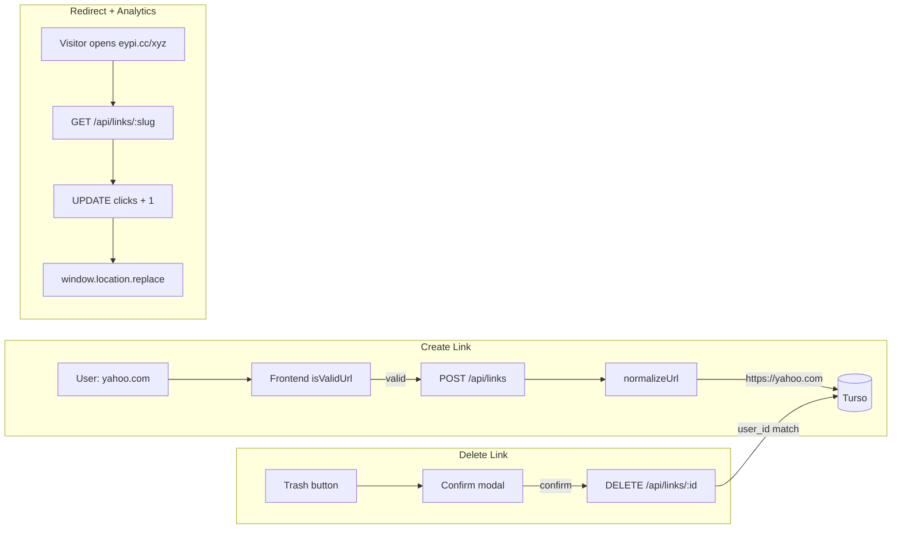

# Final Polish: Smart URL, Click Analytics, Delete Engine

## Current State Summary


| Feature       | Backend                                | Frontend                                 |
| ------------- | -------------------------------------- | ---------------------------------------- |
| **Smart URL** | Not implemented                        | `isValidUrl` exists but is stricter      |
| **Analytics** | Separate `POST /api/links/:slug/click` | RedirectView calls GET then POST /click  |
| **Delete**    | Fully implemented (lines 129-153)      | Fully implemented (executeDelete, modal) |


The Delete Engine is already complete. The plan focuses on Smart URL and Analytics, with optional Delete polish.

---

## 1. Smart URL Helper

### 1.1 Backend: Add `normalizeUrl` and use in POST/PUT

**File:** [backend/src/index.ts](backend/src/index.ts)

Add helper after the `generateSlug` declaration (around line 34):

```typescript
const normalizeUrl = (url: string) => {
  let trimmed = url.trim()
  if (!/^https?:\/\//i.test(trimmed)) trimmed = `https://${trimmed}`
  return trimmed
}
```

- **POST /api/links** (line 162): After validating `original_url`, apply `normalizeUrl(original_url)` before inserting.
- **PUT /api/links/:id** (line 109): After validating `original_url`, apply `normalizeUrl(original_url)` before updating.

### 1.2 Frontend: Relax `isValidUrl`

**File:** [src/views/DashboardView.vue](src/views/DashboardView.vue)

Replace the current `isValidUrl` (lines 313-314) with:

```typescript
const isValidUrl = (url: string) => {
  const pattern = /^(https?:\/\/)?([a-zA-Z0-9-]+\.)+[a-zA-Z]{2,}(\/.*)?$/
  return pattern.test(url.trim())
}
```

This accepts `google.com`, `https://google.com`, and `sub.domain.co/path`.

---

## 2. Click Analytics Engine

### 2.1 Backend: Increment clicks in GET /api/links/:slug

**File:** [backend/src/index.ts](backend/src/index.ts)

Update the public `GET /api/links/:slug` route (lines 72-85). After confirming the link exists and before returning the JSON, run the increment:

```typescript
// After: if (result.rows.length === 0) return c.json({ error: 'Not Found' }, 404)
// Before: return c.json(...)

await db.execute({
  sql: 'UPDATE links SET clicks = COALESCE(clicks, 0) + 1 WHERE slug = ?',
  args: [slug],
})
```

**Note:** The user's prompt had a typo: `result.rows.original_url` should be `result.rows[0]` then `.original_url`. The existing code already does this correctly.

### 2.2 Frontend: Remove redundant POST /click call

**File:** [src/views/RedirectView.vue](src/views/RedirectView.vue)

Remove the fire-and-forget `fetch` to `/api/links/:slug/click` (line 62). The GET request will now handle the increment. Simplified flow:

```typescript
if (response.ok && data.original_url) {
  window.location.replace(data.original_url)
}
```

### 2.3 Optional: Remove dead `POST /api/links/:slug/click` route

Once RedirectView no longer calls it, the backend route (lines 87-98) becomes unused. You may remove it to reduce surface area, or keep it for future external analytics integrations.

---

## 3. Delete Engine (Verification Only)

The Delete Engine is already implemented:

- **Backend** ([backend/src/index.ts](backend/src/index.ts) lines 129-153): `DELETE /api/links/:id` with JWT verification and `user_id` check.
- **Frontend** ([src/views/DashboardView.vue](src/views/DashboardView.vue)): `confirmDelete`, `executeDelete`, modal, and trash button wired.

**Optional tweak:** The spec suggests calling `fetchLinks()` after delete. The current code filters the local `links` array, which is faster. Either approach is valid; `fetchLinks()` ensures consistency with the server if other clients modify data.

---

## 4. Data Flow After Changes




---

## 5. Testing Checklist (Final Exam)

1. **Smart Link Test:** Type `yahoo.com` (no http) into the shortener. It should accept it; backend stores `https://yahoo.com`.
2. **Analytics Test:** Copy a short link, open in a new tab. After redirect, refresh the Dashboard. Clicks should increment from 0 to 1.
3. **Delete Test:** Click the trash icon, confirm deletion. Link should vanish from the table and be removed from Turso.

---

## 6. Files to Modify


| File                                                       | Changes                                                                              |
| ---------------------------------------------------------- | ------------------------------------------------------------------------------------ |
| [backend/src/index.ts](backend/src/index.ts)               | Add `normalizeUrl`, use in POST and PUT; add click increment to GET /api/links/:slug |
| [src/views/DashboardView.vue](src/views/DashboardView.vue) | Replace `isValidUrl` with relaxed pattern                                            |
| [src/views/RedirectView.vue](src/views/RedirectView.vue)   | Remove `fetch` to POST /api/links/:slug/click                                        |


