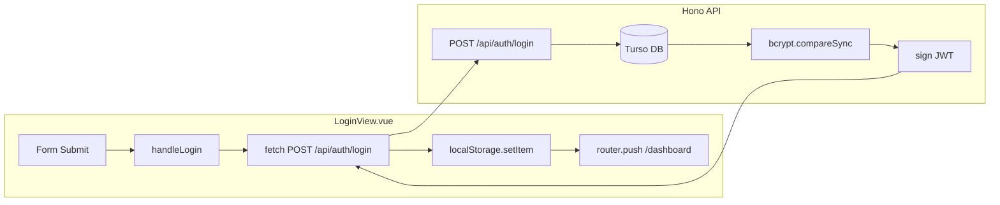

# Full-Stack Login Flow Implementation

## Current State

- **Backend** ([backend/src/index.ts](backend/src/index.ts)): Has registration route, CORS, Turso + bcrypt. Missing JWT import, `JWT_SECRET` binding, and login route.
- **Frontend** ([src/views/LoginView.vue](src/views/LoginView.vue)): Form with login/register toggle; `onSubmit` only logs to console. No API call, toast, or router.
- **Environment**: `JWT_SECRET` already exists in [backend/.dev.vars](backend/.dev.vars). No route guards for `/dashboard` yet.

---

## 1. Backend Changes (`backend/src/index.ts`)

### 1.1 Add JWT import

```typescript
import { sign } from 'hono/jwt'
```

### 1.2 Extend Bindings type

```typescript
type Bindings = {
  TURSO_DATABASE_URL: string
  TURSO_AUTH_TOKEN: string
  JWT_SECRET: string
}
```

### 1.3 Add login route (after registration route, before `export default app`)

**Important fix**: The user's snippet has `const user = result.rows` — this must be `const user = result.rows[0]` because `result.rows` is an array. The first row holds the user record.

Flow:

1. Parse `{ email, password }` from request body
2. Create Turso client with `c.env.TURSO_DATABASE_URL` and `c.env.TURSO_AUTH_TOKEN`
3. Execute `SELECT * FROM users WHERE email = ?` with `[email]`
4. If `result.rows.length === 0` → return 401 `{ status: 'error', message: 'Invalid credentials.' }`
5. Set `const user = result.rows[0]` (fix from snippet)
6. Verify password: `bcrypt.compareSync(password, user.password_hash as string)`; if invalid → 401
7. Build JWT payload: `{ sub: user.id, email: user.email, exp: Math.floor(Date.now()/1000) + 86400 }`
8. Sign: `await sign(payload, c.env.JWT_SECRET)`
9. Return 200 `{ status: 'success', message: 'Authentication successful', token }`
10. Wrap in try/catch; on error log and return 500

---

## 2. Frontend Changes (`src/views/LoginView.vue`)

### 2.1 Add imports and composables

- `useRouter` from `vue-router`
- `useToast` from `@/composables/useToast`
- `ref` (already present)

### 2.2 Add reactive state

- `isAuthenticating` ref (boolean) for loading state during login

### 2.3 Replace submit logic with `handleLogin`

Replace the current `onSubmit` implementation. When `mode === 'login'`, call `handleLogin`; when `mode === 'register'`, keep or extend register behavior (see note below).

**handleLogin** (exact behavior from spec):

1. Set `isAuthenticating.value = true`
2. `fetch('http://localhost:8787/api/auth/login', { method: 'POST', headers: { 'Content-Type': 'application/json' }, body: JSON.stringify({ email: email.value, password: password.value }) })`
3. Parse `const data = await response.json()`
4. If `!response.ok` → `throw new Error(data.message || 'Authentication failed')`
5. `localStorage.setItem('eypi_token', data.token)`
6. `toast.success('Access granted. Welcome back.')`
7. `router.push('/dashboard')`
8. In catch: `toast.error(error.message)`, `password.value = ''`
9. In finally: `isAuthenticating.value = false`

### 2.4 Wire form to handleLogin

- `onSubmit` should call `handleLogin()` when `mode === 'login'`
- Optionally disable the submit button while `isAuthenticating` (UX improvement)

### 2.5 Register mode

The spec only covers login. For register mode, either:

- Leave current `console.log` behavior, or
- Add `handleRegister` that calls `POST http://localhost:8787/api/auth/register` with `{ email, password }` (and optionally `name` if the backend supports it — currently it does not). Recommend adding a minimal `handleRegister` for consistency.

---

## 3. Production / Deployment Notes

- **JWT_SECRET**: For production Cloudflare Workers, set via `wrangler secret put JWT_SECRET` (do not commit).
- **API URL**: The frontend uses `http://localhost:8787`. For production, use an env variable (e.g. `import.meta.env.VITE_API_URL`) and configure in `vite.config` / `.env`.
- **Route guards**: No auth guard on `/dashboard` yet. Consider adding a navigation guard that checks `localStorage.getItem('eypi_token')` and redirects to `/login` if missing.

---

## Data Flow




