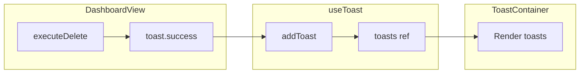

# Global Toast Notification System

## Current State

- **App.vue**: Root layout with `TheHeader`, `main` (router-view), `TheFooter`. No toast container yet.
- **DashboardView.vue**: Has `executeDelete()` at lines 308–312; filters `mockLinks` and calls `cancelDelete()`.
- **src/composables**: Folder does not exist; will be created.

## Implementation Steps

### 1. Create State Manager: `src/composables/useToast.ts`

- Create `src/composables` directory.
- Create `useToast.ts` with:
  - `ToastType`: `'success' | 'error' | 'info'`
  - `Toast` interface: `{ id, message, type }`
  - Shared `toasts` ref and `nextId` counter
  - `addToast(message, type, duration)` — pushes toast, auto-removes after `duration` (default 3000ms)
  - `removeToast(id)` — splices from array
  - Return: `{ toasts, success, error, info }` helpers

### 2. Create UI Component: `src/components/ToastContainer.vue`

- **Template structure:**
  - Root: `<div class="fixed bottom-6 right-6 z-[9999] flex flex-col gap-3 pointer-events-none">`  
  *(Note: spec had `z-` which is incomplete; use `z-[9999]` so toasts sit above modals.)*
  - Inner: `<TransitionGroup name="toast" tag="div" class="flex flex-col gap-3">`
  - Per-toast card: `w-80 bg-white border border-gray-200 shadow-xl flex items-center p-4 relative overflow-hidden pointer-events-auto`
  - Dynamic left border: `absolute left-0 top-0 bottom-0 w-1` with type-based classes:
    - success: `bg-emerald-500`
    - error: `bg-red-500`
    - info: `bg-[#34418F]`
  - Message: `font-mono text-sm font-bold ml-2 uppercase tracking-wide text-gray-800`
- **Script:** Import `useToast`, destructure `toasts`.
- **Scoped CSS:** Transition classes for slide-up + fade:

```css
  .toast-enter-active, .toast-leave-active { transition: all 0.3s cubic-bezier(0.2, 1, 0.3, 1); }
  .toast-enter-from { opacity: 0; transform: translateY(20px) scale(0.95); }
  .toast-leave-to { opacity: 0; transform: scale(0.95); }
  

```

### 3. Inject Globally in `src/App.vue`

- Add: `import ToastContainer from '@/components/ToastContainer.vue'`
- Insert `<ToastContainer />` inside the root `<div>`, just before the closing `</div>` (after `TheFooter`).

### 4. Wire to Dashboard: `src/views/DashboardView.vue`

- Add: `import { useToast } from '@/composables/useToast'`
- Add: `const toast = useToast()`
- In `executeDelete()`, after `mockLinks.value = mockLinks.value.filter(...)` and before `cancelDelete()`, add: `toast.success('Link successfully deleted')`

## Data Flow




## Files Changed


| Action | Path                                |
| ------ | ----------------------------------- |
| Create | `src/composables/useToast.ts`       |
| Create | `src/components/ToastContainer.vue` |
| Edit   | `src/App.vue`                       |
| Edit   | `src/views/DashboardView.vue`       |


