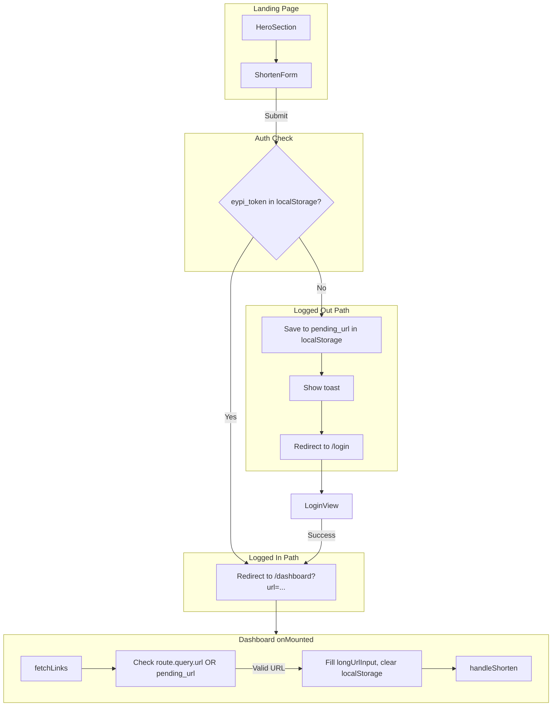

# Intent-Preserving Landing Page

## Current State

- **Landing page**: [HomeView.vue](src/views/HomeView.vue) renders [HeroSection.vue](src/components/HeroSection.vue), which contains [ShortenForm.vue](src/components/ShortenForm.vue). The Shorten button currently logs to console via `onShorten` in HeroSection.
- **Dashboard**: Uses `longUrlInput` and `handleShorten`; has `isValidUrl` helper. No logic for pending URLs.
- **Login**: Already redirects to `/dashboard` on success (line 159).

## Architecture

---

## 1. Update HeroSection (Landing Page Shorten Logic)

**File**: [src/components/HeroSection.vue](src/components/HeroSection.vue)

The Shorten form lives in HeroSection, not HomeView. Implement intent-preserving logic here:

- Add `useRouter` and `useToast`.
- Add URL validation (reuse the same pattern as Dashboard: `/^(https?:\/\/)?([a-zA-Z0-9-]+\.)+[a-zA-Z]{2,}(\/.*)?$/`).
- Replace `onShorten` with `handleShorten`:
  - Validate URL; if invalid, show toast and return.
  - If `localStorage.getItem('eypi_token')` exists: `router.push({ path: '/dashboard', query: { url: longUrl.value.trim() } })`.
  - Else: `localStorage.setItem('pending_url', longUrl.value.trim())`, `toast.error('Please log in to shorten your link!')`, `router.push('/login')`.
- Keep `longUrl` as the reactive input (already bound to ShortenForm via v-model); no need to rename to `urlInput`.

---

## 2. Update Dashboard (Consume Pending URL)

**File**: [src/views/DashboardView.vue](src/views/DashboardView.vue)

- Import `useRoute` from `vue-router`.
- In `onMounted`, after `await fetchLinks()`:
  - `const routeUrl = route.query.url as string`
  - `const savedUrl = localStorage.getItem('pending_url')`
  - `const urlToShorten = routeUrl || savedUrl`
  - If `urlToShorten && isValidUrl(urlToShorten)`:
    - `longUrlInput.value = urlToShorten`
    - `localStorage.removeItem('pending_url')`
    - `await handleShorten()`

Note: The spec used `newUrl` and `handleCreate`; the codebase uses `longUrlInput` and `handleShorten`.

---

## 3. Login Redirect (Verification Only)

**File**: [src/views/LoginView.vue](src/views/LoginView.vue)

Login already does `router.push('/dashboard')` on success (line 159). No change required. The dashboard `onMounted` will read `pending_url` from localStorage when the user arrives after login.

---

## Edge Cases

- **Invalid URL on landing**: Validate before redirect; show toast and stay on landing.
- **Query param vs localStorage**: Prefer `route.query.url` over `pending_url` so direct `/dashboard?url=...` links work.
- **Route guard**: Unauthenticated users hitting `/dashboard` are redirected to `/login`; `pending_url` is set before that redirect, so it will be available after login.
