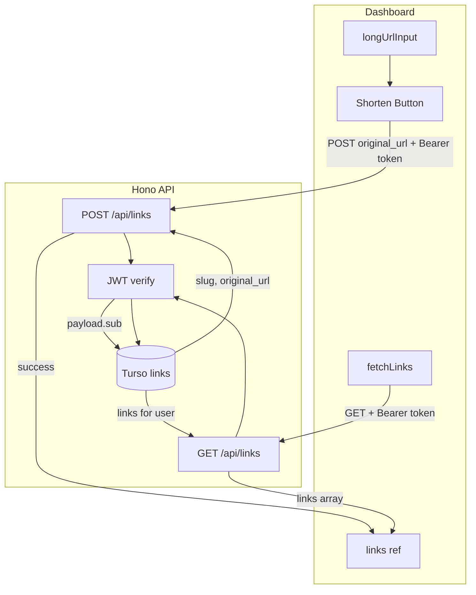

# Link Shortening CRUD Implementation

## Current State

- **Backend** ([backend/src/index.ts](backend/src/index.ts)): Has auth routes (register, login), Turso client, CORS. Uses `sign` from hono/jwt. No links routes exist.
- **Dashboard** ([src/views/DashboardView.vue](src/views/DashboardView.vue)): Uses `mockLinks` ref with hardcoded data. `handleShorten` opens the sidebar; `onSave` mutates mockLinks. Link shape: `{ id, original, short, clicks }`.
- **Auth**: Token stored as `eypi_token` in localStorage. LoginView uses `http://localhost:8787` for API calls.
- **Database**: Only `users` table exists. The `links` table does not exist and must be created.

---

## Prerequisite: Create `links` Table

The Turso database has no `links` table. Run this SQL against your Turso instance (via `turso db shell` or Turso dashboard):

```sql
CREATE TABLE IF NOT EXISTS links (
  id TEXT PRIMARY KEY,
  user_id TEXT NOT NULL,
  original_url TEXT NOT NULL,
  slug TEXT NOT NULL UNIQUE,
  clicks INTEGER DEFAULT 0,
  FOREIGN KEY (user_id) REFERENCES users(id)
);
CREATE INDEX IF NOT EXISTS idx_links_user_id ON links(user_id);
CREATE INDEX IF NOT EXISTS idx_links_slug ON links(slug);
```

---

## 1. Backend: Link Routes

**File:** [backend/src/index.ts](backend/src/index.ts)

### 1.1 Add `verify` import and `generateSlug` helper

```ts
import { sign, verify } from 'hono/jwt'
```

```ts
const generateSlug = () => Math.random().toString(36).substring(2, 8);
```

### 1.2 Add POST /api/links

- Read `Authorization` header; return 401 if missing.
- Extract token: `const token = authHeader.split(' ')[1]` (user spec had `split(' ')` returning array; must use `[1]` for Bearer token).
- `await verify(token, c.env.JWT_SECRET, 'HS256')` — Hono v4.11.4+ requires explicit `alg` when using `verify` directly.
- Parse body: `{ original_url }` (add Zod validation optional but recommended).
- Create Turso client, generate slug, run collision check (retry once if duplicate).
- Insert: `INSERT INTO links (id, user_id, original_url, slug) VALUES (?, ?, ?, ?)` with `payload.sub` as `user_id`.
- Return: `{ status: 'success', link: { slug, original_url } }`.
- Catch block: return 401 with `{ error: 'Invalid Session' }`.

### 1.3 Add GET /api/links

- Same JWT verification pattern as POST.
- Query: `SELECT id, original_url, slug, clicks FROM links WHERE user_id = ?` with `payload.sub`.
- Map rows to frontend shape: `{ id, original: original_url, short: \`eypi.cc/${slug}, clicks }`.
- Return: `{ status: 'success', links: [...] }`.
- Return 401 on invalid/missing token.

---

## 2. Frontend: Dashboard API Integration

**File:** [src/views/DashboardView.vue](src/views/DashboardView.vue)

### 2.1 Replace mock data with reactive `links`

- Remove `mockLinks` initialization.
- Add: `const links = ref<Link[]>([])`.
- Update template: change `mockLinks` to `links` everywhere (v-for, findIndex, filter, etc.).

### 2.2 Create `fetchLinks` function

- Call `GET http://localhost:8787/api/links` with header: `Authorization: Bearer ${localStorage.getItem('eypi_token')}`.
- If 401: optionally redirect to `/login` or show error toast.
- On success: `links.value = data.links`.
- Call `fetchLinks()` in `onMounted` so the dashboard loads real data on enter.

### 2.3 Update `handleShorten` to call POST /api/links

- Validate URL (keep existing `isValidUrl` check).
- Set `isShortening = true`.
- POST to `http://localhost:8787/api/links` with:
  - Headers: `Content-Type: application/json`, `Authorization: Bearer ${localStorage.getItem('eypi_token')}`
  - Body: `{ original_url: longUrlInput.value.trim() }`
- On success: append new link to `links` (or call `fetchLinks()`), show toast, clear `longUrlInput`.
- On 401: toast error, optionally redirect to login.
- Set `isShortening = false` in `finally`.

### 2.4 Adjust Shorten flow vs sidebar

Current flow: Shorten opens sidebar, user edits, Save adds to list. With the new flow:

- **Option A (recommended)**: Shorten button directly POSTs and creates the link. No sidebar for create. Sidebar remains for editing existing links (edit/delete will need future PUT/DELETE routes).
- **Option B**: Shorten still opens sidebar; Save button triggers the POST. User can optionally edit slug before saving (would require backend support for custom slug, not in current spec).

The user spec says "Update the Shorten button handler to call the new POST endpoint" — so **Option A** is intended: Shorten = immediate POST.

### 2.5 Update `Link` interface

- Keep `id` as string (UUID from backend).
- Ensure `short` format matches API: `eypi.cc/${slug}`.

---

## 3. Data Flow




---

## 4. Implementation Notes

- **API base URL**: Reuse `http://localhost:8787` as in LoginView. Consider extracting to `import.meta.env.VITE_API_URL` or a constant for future env-based config.
- **Edit/Delete**: The sidebar edit and delete modal currently mutate `mockLinks`. After switching to `links`, they will need corresponding PUT/DELETE backend routes to persist changes. This plan focuses on Create + Read only.
- **Redirect engine**: [src/views/RedirectView.vue](src/views/RedirectView.vue) still uses a mock DB. Wiring it to Turso (lookup by slug) is out of scope for this plan but is the natural next step.

---

## 5. Testing Checklist

1. Create `links` table in Turso.
2. Login, go to dashboard. Verify `fetchLinks` runs and shows empty state (or existing links).
3. Paste URL, click Shorten. Verify POST succeeds, new link appears, input clears.
4. Refresh page. Verify links persist (fetchLinks loads them).
5. Test 401: remove token, try Shorten or reload dashboard — expect error handling.

