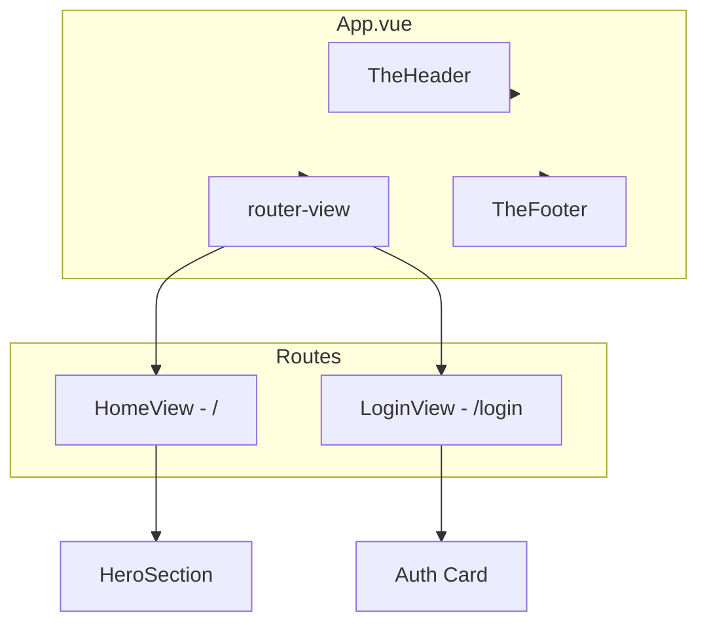

# SPA Routing & Auth Module Plan

## Current State

- **App.vue** renders `TheHeader`, `HeroSection`, and `TheFooter` directly
- **TheHeader.vue** has a Login `<a href="#">` (line 16-21)
- **HeroSection.vue** contains the hero content, corner crosshairs, Pasay coordinates (`14.531105 N // 121.021309 E`), and "Login to customize" text (line 64-66)
- **mica-card** class exists in [src/styles/main.css](src/styles/main.css) with blur, border, and shadow
- No `vue-router` in [package.json](package.json)

---

## Architecture After Refactor




---

## 1. Install and Configure Vue Router

**Install:**

```bash
npm install vue-router@4
```

**Create [src/router/index.ts](src/router/index.ts):**

- Use `createRouter` with `createWebHistory()` for clean URLs
- Routes:
  - `/` → `HomeView.vue`
  - `/login` → `LoginView.vue`
- Lazy-load views: `() => import('@/views/HomeView.vue')` (optional; can use direct imports for simplicity)

**Update [src/main.ts](src/main.ts):**

- Import router and add `app.use(router)` before `mount`

---

## 2. Refactor Layout

**Create [src/views/HomeView.vue](src/views/HomeView.vue):**

- Wrap `HeroSection` in a section with the same layout classes as current main content
- Use `flex min-h-0 flex-1 flex-col` so the view fills available space

**Update [src/App.vue](src/App.vue):**

- Replace `<HeroSection />` with `<router-view />`
- Keep `bg-dot-grid`, `TheHeader`, `TheFooter`
- Ensure main wrapper uses `flex min-h-0 flex-1 flex-col overflow-hidden` so child views can center vertically

**Update [src/components/TheHeader.vue](src/components/TheHeader.vue):**

- Replace the Login `<a href="#">` with `<router-link to="/login">` (keep same styling)

**Update [src/components/HeroSection.vue](src/components/HeroSection.vue):**

- Wrap "Login to customize" in `<router-link to="/login">` instead of a plain `<span>`

---

## 3. Build LoginView.vue

**Create [src/views/LoginView.vue](src/views/LoginView.vue):**

**Container:**

- `flex flex-col items-center justify-center min-h-[calc(100vh-120px)] relative` (or equivalent to fill viewport minus header/footer)
- Reuse corner crosshairs from HeroSection (4 L-shaped borders at corners)
- Reuse Pasay coordinate text on left edge: `COORD. 14.531105 N // 121.021309 E`

**Auth Card (mica-card):**

- `w-full max-w-md p-8 rounded-3xl border border-gray-200 relative`
- Apply `.mica-card` class
- 4 corner screws: `h-2 w-2 rounded-full bg-gray-400 shadow-inner` at each corner

**Toggle State:**

```ts
const mode = ref<'login' | 'register'>('login')
```

**Top Toggles:**

- Flex row with two pill buttons: "Login" and "Register"
- Active: `bg-[#34418F] text-white font-mono font-bold`
- Inactive: `bg-transparent text-gray-400 font-mono hover:text-[#34418F]`
- Click handlers set `mode.value = 'login'` or `'register'`

**Header:**

- Centered monospace heading: "LOGIN" or "REGISTER" based on `mode`

**Form Inputs:**

- Mechanical style: `bg-white/50 border-2 border-gray-200 focus:border-[#34418F] rounded-lg px-4 py-3 font-mono outline-none w-full mb-4`
- **Login mode:** Email, Password
- **Register mode:** Name, Email, Password

**Submit Button:**

- Full-width, APC Gold (`#DEAC4B`): `[ PROCEED ]` or `[ AUTHENTICATE ]`
- Uppercase monospace
- No backend logic yet; `@submit.prevent` with empty handler or `console.log`

---

## 4. File Summary


| Action  | File                             |
| ------- | -------------------------------- |
| Create  | `src/router/index.ts`            |
| Create  | `src/views/HomeView.vue`         |
| Create  | `src/views/LoginView.vue`        |
| Modify  | `src/main.ts`                    |
| Modify  | `src/App.vue`                    |
| Modify  | `src/components/TheHeader.vue`   |
| Modify  | `src/components/HeroSection.vue` |
| Install | `vue-router@4`                   |


---

## 5. Out of Scope (Future)

- Turso database integration for storing users
- Actual authentication logic (API calls, tokens)
- Form validation

---

## 6. Verification

After implementation:

1. Run `npm run dev` and confirm no errors
2. Click "Login" in header → navigates to `/login` without full page reload
3. Click "Login to customize" in hero → same behavior
4. Toggle between Login/Register on `/login` → form fields swap correctly
5. Browser back/forward works for `/` and `/login`

