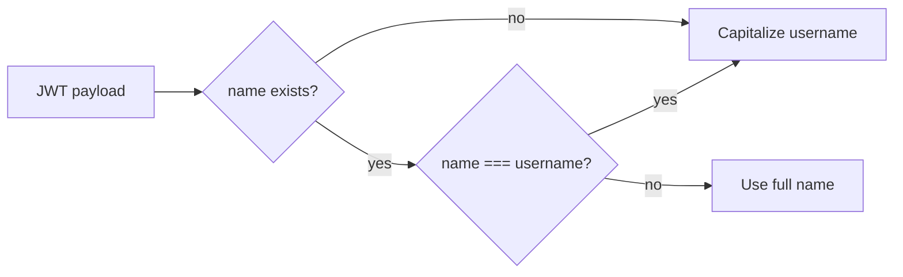

# UX Refinement: Dynamic Names, Mobile-First UI, and Dark Mode

## 1. Fix Name Display in TheHeader.vue

**Current state:** The backend JWT payload only includes `sub`, `email`, and `exp` ([backend/src/index.ts](backend/src/index.ts) lines 363-366). The users table has no `name` column. [TheHeader.vue](src/components/TheHeader.vue) (line 78) falls back to capitalized email username when `payload.name` is missing.

**Required changes:**

- **Backend:** Add `name` support end-to-end:
  - Add migration: `ALTER TABLE users ADD COLUMN name TEXT;`
  - Extend register schema in [backend/src/index.ts](backend/src/index.ts) to accept optional `name` (z.string().optional())
  - Update INSERT/UPDATE to include `name` when provided
  - In login route: fetch `name` from user row, include in JWT payload: `{ sub, email, name, exp }`
- **LoginView:** Send `name` in register request body when in register mode (the input exists but is not sent)
- **TheHeader:** Refine display logic:
  - Prefer `payload.name` when present and distinct from email username
  - If `name` equals email username (e.g., "arlaus") or is missing, use capitalized username: `email.split('@')[0]` with `charAt(0).toUpperCase() + slice(1)`




---

## 2. Mobile-First Responsiveness

### DashboardView.vue

- **Create Link section** (lines 7-23): Change `flex w-full gap-4` to `flex flex-col md:flex-row w-full gap-4` so input and button stack on small screens
- **Table layout** (lines 26-141): On mobile, either:
  - **Option A (recommended):** Wrap table in `overflow-x-auto` with `min-w-[600px]` on the inner container so it scrolls horizontally without breaking page width
  - **Option B:** Add a card layout for `max-md:` breakpoint that shows each link as a vertical card (short URL, original, clicks, actions)
- **Padding:** Change `pt-16` (line 4) to `pt-8 md:pt-16`

### HomeView / HeroSection / ShortenForm

- **ShortenForm.vue** ([src/components/ShortenForm.vue](src/components/ShortenForm.vue)): Already uses `flex-col sm:flex-row` (line 2). Align with spec by changing to `flex-col md:flex-row` if desired (md = 768px vs sm = 640px)
- **HeroSection.vue:** No Create Link table; the ShortenForm is the main input. Ensure padding is consistent (e.g., `pt-8 md:pt-16` if HeroSection has top padding)

---

## 3. Remove Page Transitions

**File:** [src/App.vue](src/App.vue)

- Remove the `<transition name="wave-slide" mode="out-in">` wrapper (lines 25-28)
- Replace with direct `<component :is="Component" />` inside the router-view slot
- Delete the `.wave-slide-`* CSS (lines 46-122) and the `keepAlive` keyframe

**Before:**

```vue
<router-view v-slot="{ Component }">
  <transition name="wave-slide" mode="out-in">
    <component :is="Component" />
  </transition>
</router-view>
```

**After:**

```vue
<router-view v-slot="{ Component }">
  <component :is="Component" />
</router-view>
```

---

## 4. Dark Mode Preparation

### 4.1 Tailwind Configuration

- Add `darkMode: 'class'` to [tailwind.config.js](tailwind.config.js) so Tailwind uses the `dark` class on the root element

### 4.2 Root HTML and Toggle

- **index.html:** Vue mounts to `#app`; the `html` element is in index.html. We need to toggle `document.documentElement.classList.toggle('dark')` from Vue.
- **Toggle placement:** Add a dark mode toggle (sun/moon icon) in [TheHeader.vue](src/components/TheHeader.vue), or a minimal floating toggle. Persist preference in `localStorage` and apply on app load in [main.ts](src/main.ts) or App.vue.

### 4.3 Base Layer / Grid Opacity

- **App.vue base layer** (lines 4-20): The `#base-layer` has `bg-dot-grid`, corner marks (`border-gray-300`), and coordinates (`text-gray-400`). Add dark-mode variants:
  - In [src/styles/main.css](src/styles/main.css), add `.dark .bg-dot-grid` with:
    - Dark background (e.g., `#1a1a2e` or `#0f172a`)
    - Lower opacity dot grid: `rgba(52, 65, 143, 0.08)` instead of `0.15` so it does not overwhelm text
  - Corner marks and coordinates: use Tailwind `dark:` variants where applicable, or add `.dark` scoped overrides in main.css

### 4.4 Wave Shutter (if kept elsewhere)

- The wave-slide transition is being removed, so no dark-mode adjustment needed for it.

---

## File Summary


| File                             | Changes                                                            |
| -------------------------------- | ------------------------------------------------------------------ |
| `backend/src/index.ts`           | Add name to register schema, INSERT, and JWT payload               |
| `backend/migrations/`            | New migration: add `name` column to users                          |
| `src/components/TheHeader.vue`   | Refine name logic; add dark mode toggle                            |
| `src/views/LoginView.vue`        | Send `name` in register body                                       |
| `src/views/DashboardView.vue`    | flex-col md:flex-row, pt-8 md:pt-16, table overflow or card layout |
| `src/components/ShortenForm.vue` | Optional: sm → md breakpoint                                       |
| `src/components/HeroSection.vue` | Padding audit if needed                                            |
| `src/App.vue`                    | Remove transition wrapper and wave-slide CSS                       |
| `tailwind.config.js`             | Add darkMode: 'class'                                              |
| `src/styles/main.css`            | Add .dark .bg-dot-grid with lower opacity                          |
| `src/main.ts` or `App.vue`       | Apply saved dark preference on load                                |


---

## Implementation Order

1. Backend: migration + register/login name support
2. LoginView: send name in register
3. TheHeader: name display logic
4. App.vue: remove transitions
5. DashboardView + ShortenForm + HeroSection: mobile responsiveness
6. Dark mode: tailwind config, main.css, toggle, persistence

